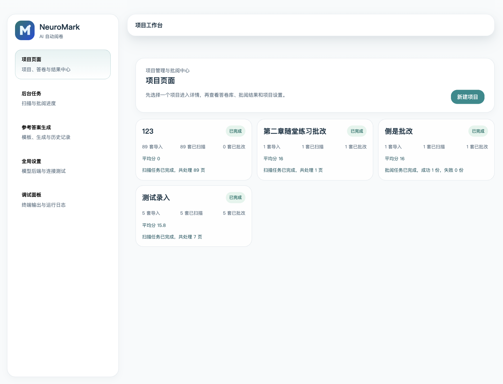
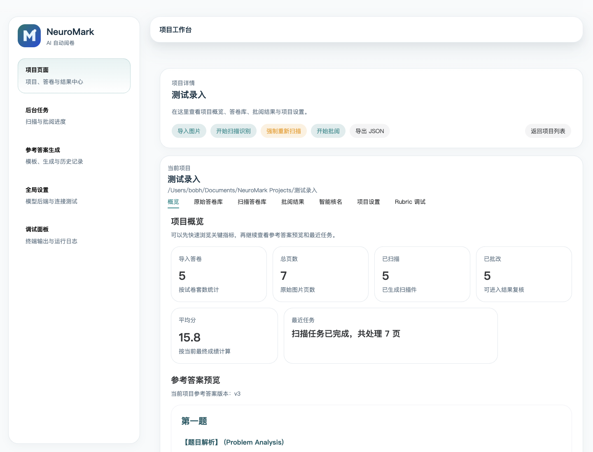
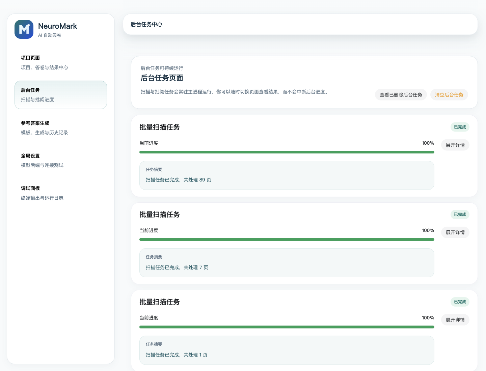
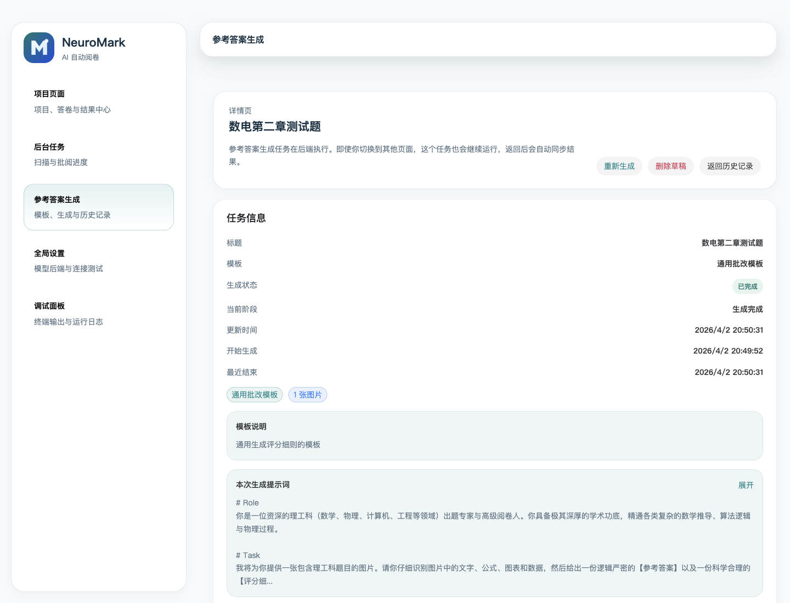
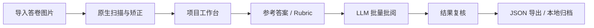

<div align="center">


# NeuroMark

### 一个面向 AI 自动阅卷的本地优先桌面工作台

<p>
  <a href="https://www.electronjs.org/"></a>
  <a href="https://vuejs.org/"></a>
  <a href="https://www.typescriptlang.org/"></a>
  <a href="https://platform.openai.com/docs/overview"></a>
  <a href="https://github.com/BobH233/NeuroMark/actions/workflows/electron-build.yml"></a>
  
  <a href="./LICENSE"></a>
</p>

<p>
  NeuroMark 试图把 <strong>答卷导入、扫描矫正、参考答案生成、批量批阅、结果复核、导出归档</strong>
  放进一个真正可用的桌面工作流里。<br />
  这是一个正在开源中的项目，也希望逐步成长为一个欢迎教师、开发者、OCR/LLM 工程师共同参与的社区项目。
</p>

<p>
  <a href="#功能亮点">功能亮点</a> ·
  <a href="#界面预览">界面预览</a> ·
  <a href="#快速开始">快速开始</a> ·
  <a href="#架构概览">架构概览</a> ·
  <a href="#路线图">路线图</a> ·
  <a href="#参与共建">参与共建</a>
</p>

</div>

---

## 为什么是 NeuroMark

很多“AI 阅卷”产品只停留在接口演示，缺少真实场景需要的工程闭环。NeuroMark 更关注下面这些问题：

- 如何把教师手里的原始答卷图片整理成可持续追踪的项目目录。
- 如何在本地完成扫描矫正、任务编排、结果缓存，而不是每次都从零开始。
- 如何把参考答案、评分细则、批阅结果和人工复核放在同一工作台里。
- 如何让 LLM 参与批改，但不牺牲可追踪性、可导出性和后续维护性。

一句话说，NeuroMark 想做的不是一个“调用模型的按钮”，而是一个真正可协作、可演进、可开源的阅卷基础设施。

## 功能亮点

- `本地优先工作流`
  项目数据、答卷图片、参考答案、结果导出都落在本地目录中，状态由 SQLite 管理，便于长期归档和二次处理。
- `原生扫描模块`
  内置 C++/OpenCV 扫描能力，可对答卷图片进行文档检测、矫正、调试预览与后处理。
- `批量后台任务`
  扫描、批阅、参考答案生成都以后台任务方式运行，切换页面不会中断流程。
- `参考答案生成`
  支持基于题目图片与提示词模板生成 Markdown 版参考答案与评分细则草稿。
- `项目级批阅工作台`
  在同一个项目内查看原始答卷、扫描件、批阅结果、评分明细、参考答案版本和导出结果。
- `智能核名`
  面向已批阅答卷提供智能核名能力，帮助将模型识别结果与名册做进一步校对。
- `可调项目设置`
  支持按项目设置并发数、区域绘制、扫描后处理等参数，便于不同批改场景调优。
- `OpenAI 兼容后端`
  可在全局设置中配置兼容 OpenAI API 的模型后端、超时、温度与推理强度。

## 界面预览

<!-- demo-video:start -->
> 演示视频：[点击查看小红书演示视频](http://xhslink.com/o/5nvUNA3bDYg)
<!-- demo-video:end -->

| 项目总览 | 项目详情 |
| --- | --- |
|  |  |

| 后台任务中心 | 参考答案生成 |
| --- | --- |
|  |  |

## 典型工作流



## 架构概览

### 技术栈

| 层 | 技术 |
| --- | --- |
| Desktop Shell | Electron |
| UI | Vue 3 + Vue Router + Pinia + Naive UI |
| Language | TypeScript |
| Local Storage | SQLite + Drizzle ORM |
| Native Scanning | C++ addon + OpenCV + ONNX |
| Image Processing | Sharp |
| LLM Access | OpenAI SDK |
| Testing | Vitest + Playwright |

### 仓库结构

```text
.
├─ src/main/                  # Electron main process, services, IPC, database
├─ src/preload/               # Preload bridge and typed contracts
├─ src/renderer/              # Vue renderer app
├─ src-native/scancpp/        # Native scanning module and model assets
├─ scripts/                   # Build and CI helper scripts
├─ tests/                     # Automated tests
└─ docs/images/               # README screenshots
```

### 项目目录结构

NeuroMark 为每个项目创建独立目录，便于归档、迁移和人工检查：

```text
your-project/
├─ originals/                 # 原始答卷图片
├─ scanned/                   # 扫描矫正后的图片
├─ scan-debug/                # 扫描调试产物
├─ reference-answer/          # 参考答案与评分细则
├─ results/                   # 批阅结果
├─ exports/                   # 导出文件
└─ project.json               # 项目元信息
```

## 快速开始

### 直接下载成品

如果你只是想直接使用 NeuroMark，不需要自己编译，可以前往 GitHub Releases 下载已打包好的安装包或压缩包：

- [NeuroMark Releases](https://github.com/BobH233/NeuroMark/releases)

下载后解压或安装，首次启动后：

1. 在 `全局设置` 中填写模型后端、模型名和 API Key。
2. 创建一个项目目录。
3. 导入答卷图片并执行扫描。
4. 准备或生成参考答案。
5. 发起批阅并在项目详情中复核结果。

### 源码开发

如果你希望参与开发、调试或自行构建，请继续参考下面的源码运行说明。

### 环境要求

- Node.js `>= 22`
- npm `>= 10`
- 支持本地原生模块编译的开发环境
- 一个可用的 OpenAI 兼容模型后端

### 安装依赖

```bash
npm install
```

### 启动开发环境

```bash
npm run dev
```

应用启动后：

1. 在 `全局设置` 中填写模型后端、模型名和 API Key。
2. 创建一个项目目录。
3. 导入答卷图片并执行扫描。
4. 准备或生成参考答案。
5. 发起批阅并在项目详情中复核结果。

### 构建

```bash
npm run build
```

### 打包

```bash
npm run package
```

### 测试

```bash
npm run test:unit
npm run test:e2e
```

## 当前适合谁使用

- 想搭建本地化 AI 阅卷工具链的个人开发者
- 希望把题目图片、参考答案、批阅结果统一管理的教师或助教
- 对 OCR、文档扫描、评分系统、教育工作流有兴趣的开源贡献者
- 需要一个 Electron + Vue + Native Addon + LLM 组合项目作为参考实现的工程团队

## 路线图

### 近期计划

- 完善 README、贡献指南、Issue 模板和路线图管理
- 补充安装文档与跨平台构建说明
- 打磨项目详情页的批阅复核体验
- 继续增强扫描鲁棒性与调试可观测性

### 中期计划

- 更强的名册匹配与智能核名工作流
- 更细粒度的评分细则编辑与版本管理
- 更稳定的导出格式与结果二次分析能力
- 更完整的自动化测试覆盖
- 社区 demo 数据集与示例项目

### 长期方向

- 面向社区的插件化评分策略
- 多模型 / 多后端切换能力
- 更成熟的协作与共享工作流
- 面向真实教学场景的可部署发行版

## 参与共建

这个仓库现在正处在“从可用原型走向社区项目”的阶段，非常欢迎一起把它打磨成更靠谱的开源基础设施。

你可以通过这些方向参与：

- 修复 bug、优化交互和补测试
- 改进扫描算法、图像处理和原生模块稳定性
- 优化提示词、评分结构和模型输出约束
- 完善文档、示例项目、上手教程与社区素材
- 提供真实教学场景下的反馈和需求

如果你准备提交 PR，建议先开一个 Issue 或 Discussion，同步一下方向和边界，能让协作更顺畅。

## 开源说明

- License: MIT
- 当前版本：`0.1.0`
- 项目状态：可运行、可演示、适合继续打磨，不建议在高风险正式场景中直接无验证投入使用

## 致谢

感谢所有愿意一起探索 AI 阅卷、教育工作流、文档扫描和本地优先桌面工具的人。NeuroMark 想做成的，不只是一个仓库，而是一套能被社区共同推进的实践样本。
